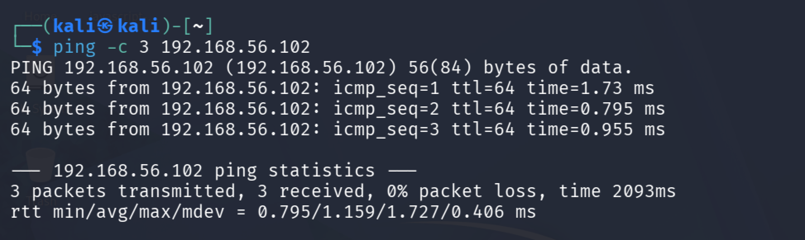

# 🔐 Linux Privilege Escalation Lab

> Hands-on Linux privilege escalation assessment using Kali Linux and Metasploitable 2.

## 🎯 Objective

The goal of this lab was to follow a basic penetration testing workflow:

**Reconnaissance → Enumeration → Finding → Exploitation → Root Proof → Remediation**

I performed the assessment in a controlled VirtualBox lab environment.

---

## 🖥️ Lab Environment

- 🔴 Attacker: Kali Linux
- 🎯 Target: Metasploitable 2
- 🌐 Target IP: `192.168.56.102`
- 💻 Virtualization: VirtualBox
- 🛡️ Environment: Controlled lab

---

# 🔎 1. Network Connectivity

I first verified that Kali Linux could communicate with the target machine.

### Command

```bash
ping -c 4 192.168.56.102



## 🔍 2. Service Enumeration

I used Nmap to identify open ports and running service versions.

### Command

```bash
nmap -sV 192.168.56.102
